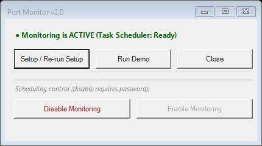
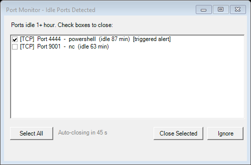

# Port Monitor

> Automatically detects forgotten pentest listeners and suspicious idle ports — before they become a problem.

## The Problem

You finish a Kali Linux exercise. You close the terminal.  
But `netcat` on port `4444` is still listening — wide open, waiting for a connection from anyone.

Tools like **nmap** or **netstat** give you a snapshot: *"what's open right now?"*  
They can't tell you *how long* a port has been idle, or whether you forgot to close it.

## The Solution

Port Monitor runs **inside your machine**, continuously, and tracks how long each unknown port has been idle. It alerts only after **one full hour** of no active connections — exactly the signature of a forgotten tool, not a legitimate service.

## Screenshots

| Control Panel | Alert Window |
|:---:|:---:|
|  |  |

## Quick Start

1. Download [`port-monitor.bat`](port-monitor.bat) — single file, no Python, no Node.js, no installer
2. Double-click to open the control panel
3. Click **Setup** → approve consent → optionally read the built-in README
4. Done. Task Scheduler runs the monitor every 15 minutes automatically.

## How It Works

| Step | What happens |
|------|-------------|
| Every 15 min | Hidden Windows Task Scheduler job scans all TCP/UDP listeners |
| Per unknown port | Any active connections? Real services always have traffic. |
| After 1 hour idle | Alert popup appears bottom-right listing idle ports |
| On alert | Check the port → "Close Selected" terminates the owning process |

## Detection Logic

The key insight: a **forgotten listener** sits completely idle for hours. A **legitimate service** always has traffic. Port Monitor catches exactly this difference — the same reasoning you'd apply in SOC alert triage.

- Unknown TCP port, no active connections for 60+ min → **ALERT**
- Unknown UDP listener present for 60+ min → **ALERT**
- Known-safe process or port → **ignored** automatically

## Features

- **Single `.bat` file** — no Python, no Node.js, no installer. Copy anywhere and run.
- **Smart whitelist** — ~35 known-safe processes, ~25 ports excluded automatically
- **Localhost exclusion** — `127.0.0.1` listeners are ignored (unreachable from network)
- **TCP + UDP** — covers both protocols
- **Process identification** — alerts show `[TCP] Port 4444 – powershell (idle 87 min)`
- **Tamper protection** — SHA-256 hash verified on every run; alerts if modified
- **Password-protected disable** — can't be silently turned off by malware
- **Auto-closes** — alert window auto-closes after 45 seconds
- **Custom exceptions** — add your own entries via `port-monitor.config.json`

## Why Not Just nmap?

| Tool | Perspective | Alerts? | Idle tracking? |
|------|-------------|:-------:|:--------------:|
| nmap | External scanner | ✗ | ✗ |
| netstat / ss | Point-in-time snapshot | ✗ | ✗ |
| **Port Monitor** | Internal, continuous | ✓ | ✓ 60-min threshold |

## Custom Exceptions

Create `port-monitor.config.json` in the same folder as the script:

```json
{ "extraProcesses": ["myapp"], "extraPorts": [8888], "extraUDPPorts": [1234] }
```

## Built With

PowerShell (Windows Forms, Task Scheduler).  
Spec designed by Roy — implemented with [Claude Code](https://claude.ai/code) (Anthropic).

## License

[MIT](LICENSE)
